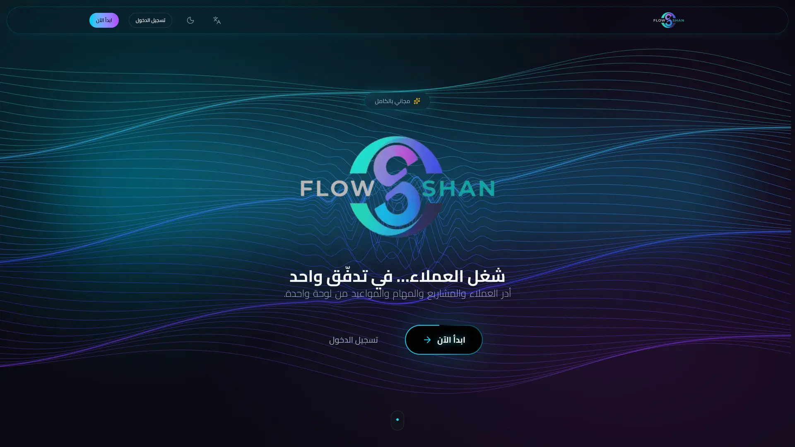
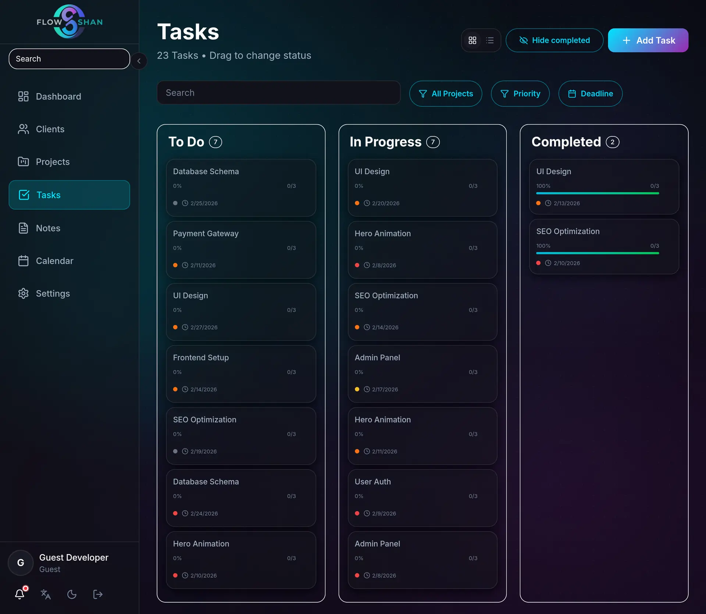
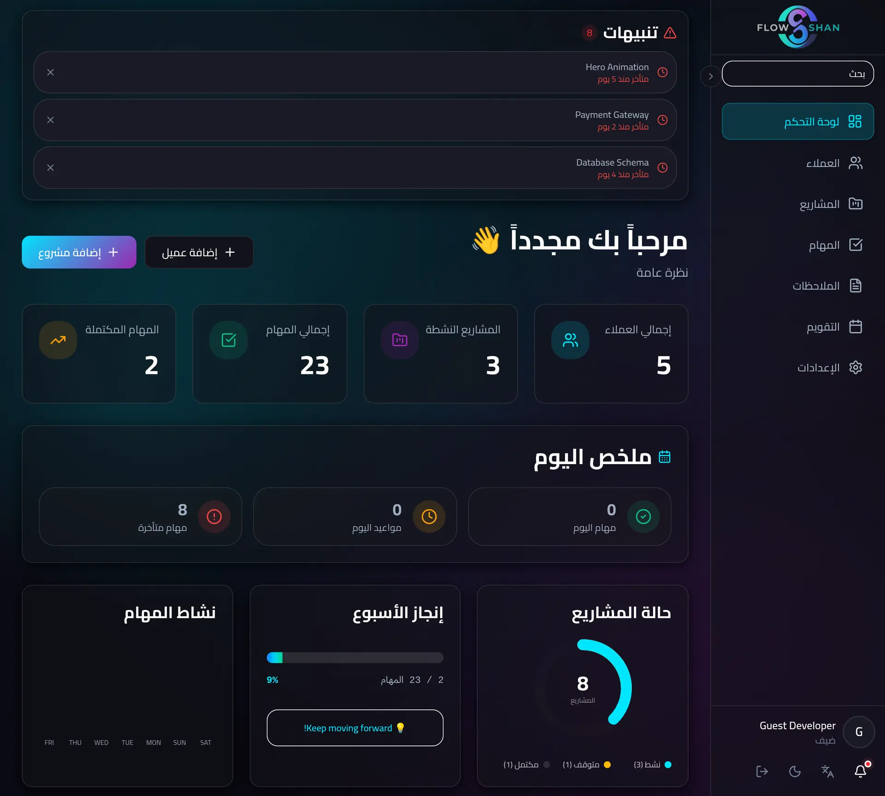
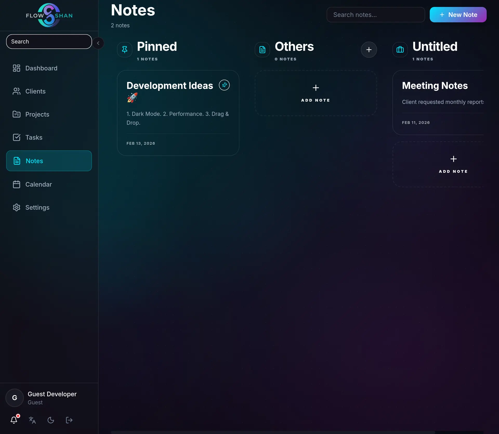

 

### ⚡ الإنتاجية المحلية أولاً (Local-First) بتجربة استخدام سينمائية

> **تفاعل فوري، مزامنة سلسة، وتجربة مطور متميزة.**

  
  
  

 

 

 

## 📋 الملخص التنفيذي
**FlowShan** هي منصة إنتاجية صممت حول مبدأ **"المحلية أولاً" (Local-First)**. تعطي الأولوية للتفاعل الفوري للمستخدم باستخدام تحديثات واجهة المستخدم المتفائلة (Optimistic UI) وإدارة الحالة المحلية، مع مزامنة البيانات مع السحابة في الخلفية.

تحلل دراسة الحالة هذه المعمارية، التحديات، والقرارات التقنية وراء بناء أداة إنتاجية عالية الأداء بتجربة سينمائية.

 

 

## 📊 إحصائيات المشروع

| المؤشر | التفاصيل |
|:---|:---|
| **التقنية الأساسية** | Next.js 16.2 (App Router / Turbopack), React 19, TypeScript |
| **التصميم** | Tailwind CSS v4, Framer Motion (تأثيرات سينمائية) |
| **إدارة الحالة** | Zustand (7 Stores), Local-First Architecture |
| **الخلفية** | Server Actions, Prisma ORM, PostgreSQL |
| **المكونات** | 70+ مكون واجهة قابل لإعادة الاستخدام |
| **التفاعل** | نظام صوت Web Audio (نغمة إنجاز C6-E6)، تأثيرات جسيمات تفاعلية، مستشعرات اللمس |
| **الأداء** | زمن استجابة أقل من 100ms، بناء مجمّع Turbopack خلال ~30 ثانية |

 

 

## 📸 معرض الصور

  
  
  
  

 

 

## 🏗️ معمارية النظام

يستخدم النظام **محرك مزامنة هجين (Hybrid Sync Engine)**:
1.  **وضع الزائر:** وظائف كاملة باستخدام `localStorage`.
2.  **وضع المصادقة:** مزامنة في الخلفية مع PostgreSQL/Prisma.
3.  **حل التعارض:** (Last-write-wins) مع واجهة متفائلة.

  

 

 

## 📚 فهرس الوثائق

استكشف التفاصيل التقنية الكاملة:

| # | الوثيقة | الوصف |
|:--:|:---|:---|
| **01** |  | الرؤية، الفلسفة الجوهرية، ونطاق المشروع. |
| **02** |  | تحدي بناء تطبيقات Local-First حديثة. |
| **03** |  | تصميم النظام، تدفق البيانات، ومنطق المزامنة. |
| **04** |  | كانبان، التقويم، الملاحظات، تصميم الصوت، واللوحة التفاعلية بصفحة الهبوط. |
| **05** |  | لماذا Next.js 16؟ لماذا Zustand بدلاً من Redux؟ |
| **06** |  | حل مشاكل الـ Hydration، تضارب السحب على الموبايل، والتشغيل التلقائي للصوت. |
| **07** |  | تقنيات تحسين الأداء ومقاييس بناء مجمّع Turbopack الفائقة. |
| **08** |  | استراتيجية ضمان الجودة ومنهجيات الاختبار. |
| **09** |  | خط أنابيب النشر على Vercel و CI/CD. |
| **10** |  | المقاييس النهائية ونتائج الأعمال. |

 

 

### جاهز للبدء؟

