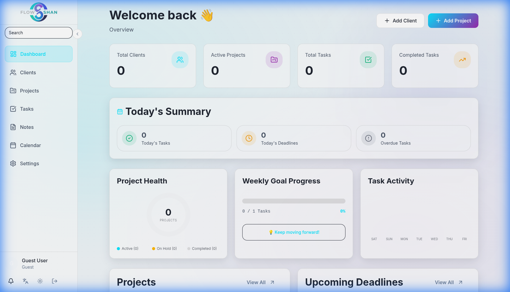
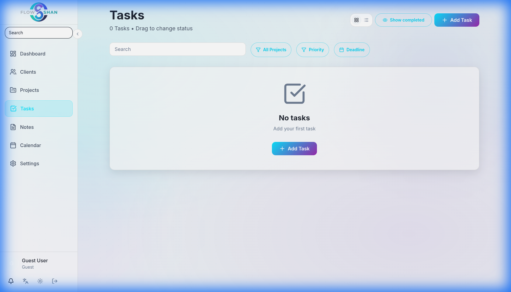
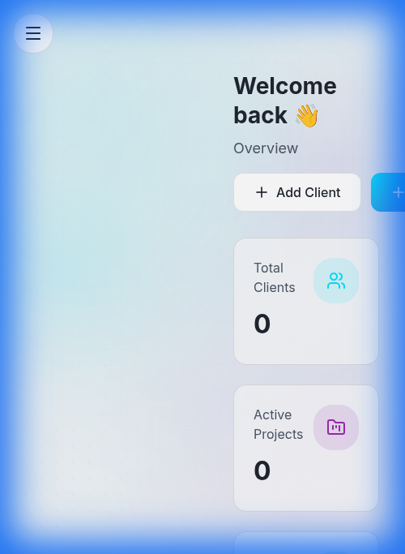

<!-- Language Switcher -->

  <a href="README.md">English Version</a>

<!-- Title Branding -->

 

<blockquote align="center">
  <b>"أدوات الإنتاجية يجب أن تكون ملهمة. زمن استجابة صفري، تصميم زجاجي، ومزامنة محلية أولاً."</b>
</blockquote>

---

<!-- Live Demo Button -->

  
  

## 📸 المعرض البصري (إثباتات العمل)

<table align="center" dir="rtl">
  <tr>
    <td align="center"><b>لوحة التحكم الحية (Bento Grid)</b></td>
    <td align="center"><b>تكامل تيليجرام والمزامنة الفورية</b></td>
  </tr>
  <tr>
    <td></td>
    <td></td>
  </tr>
  <tr>
    <td align="center"><b>سير عمل Kanban (سحب وإفلات)</b></td>
    <td align="center"><b>استجابة كاملة للهواتف المحمولة</b></td>
  </tr>
  <tr>
    <td></td>
    <td></td>
  </tr>
</table>

---

## ⚡ تميز الأداء (Performance)

  <table align="center" dir="rtl">
    <tr>
      <td align="center"><b>تقرير Lighthouse (100/100)</b></td>
      <td align="center"><b>إشعارات فورية (Push Notifications)</b></td>
    </tr>
    <tr>
      <td></td>
      <td></td>
    </tr>
  </table>

---

## 🛠️ مجرة التقنيات (Tech Stack)

| **الطبقة** | **التقنيات المستخدمة** |
|:---:|:---|
| **الأساس** |    |
| **التصميم** |   |
| **المنطق** |    |
| **البيئة** |   |

---

## 📂 تحليل عميق: دراسة الحالة (10 أجزاء)

لتحليل هندسي معمق، استكشف باقة التوثيق الكاملة:

1. [**01-نظرة عامة**](docs/01-Overview.ar.md) - رؤية المشروع والأثر.
2. [**02-تحديد المشكلة**](docs/02-Problem-Statement.ar.md) - الاحتكاك والإرهاق البصري.
3. [**03-هندسة الحلول**](docs/03-Solution-Architecture.ar.md) - محرك المزامنة ثلاثي الطبقات.
4. [**04-الميزات الجوهرية**](docs/04-Key-Features.ar.md) - التصميم الزجاجي والمحلية أولاً.
5. [**05-القرارات التقنية**](docs/05-Technical-Decisions.ar.md) - سجل القرارات الهندسية (ADR).
6. [**06-التحديات والحلول**](docs/06-Challenges-Solutions.ar.md) - معالجة خرائط التبعيات.
7. [**07-تحسين الأداء**](docs/07-Performance-Optimization.ar.md) - حجم الحزمة وفلسفة الـ Hydration.
8. [**08-الجودة والاختبار**](docs/08-Testing-Quality.ar.md) - أنظمة التحقق التلقائي.
9. [**09-النشر والعمليات**](docs/09-Deployment-DevOps.ar.md) - وظائف الحافة والـ CI/CD.
10. [**10-النتائج والنتائج النهائي**](docs/10-Results-Impact.ar.md) - النتائج النهائية والأثر.

---

  
  
© 2026 <b>CODESHAN</b> | MIT License

