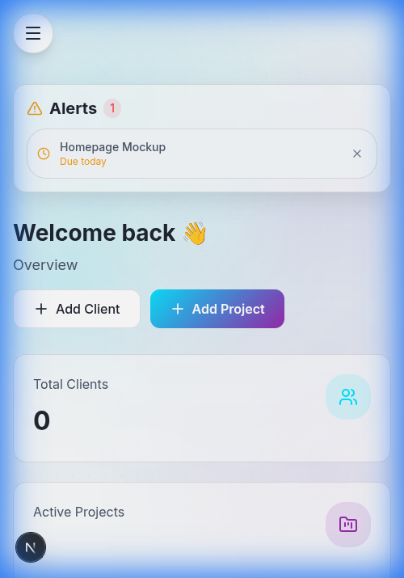
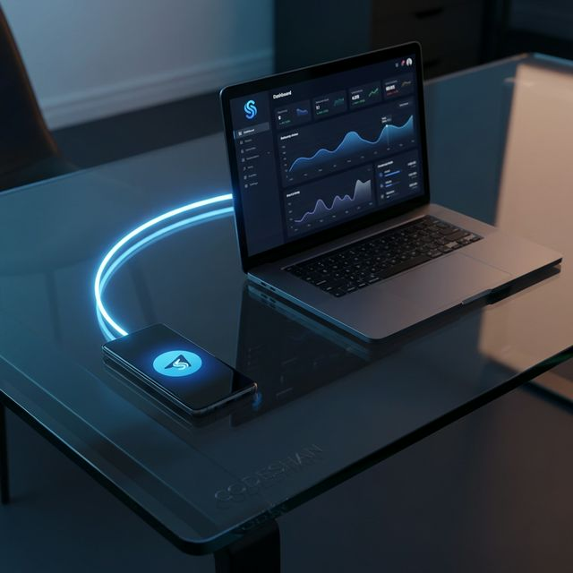
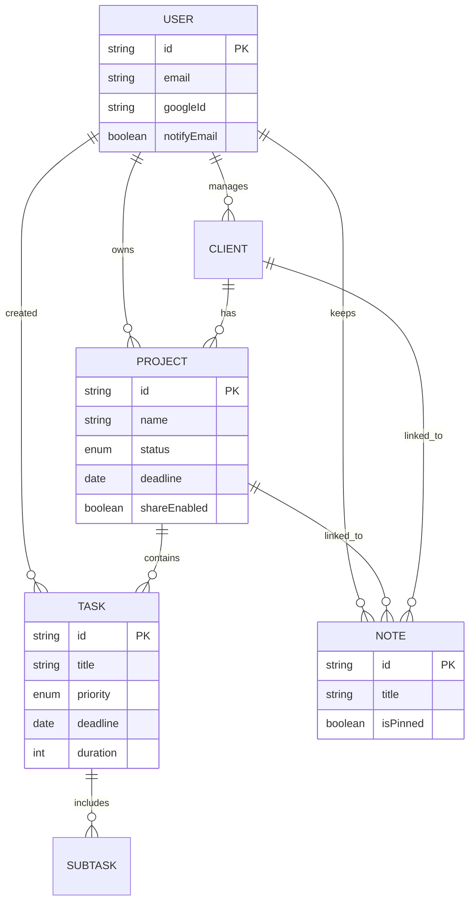
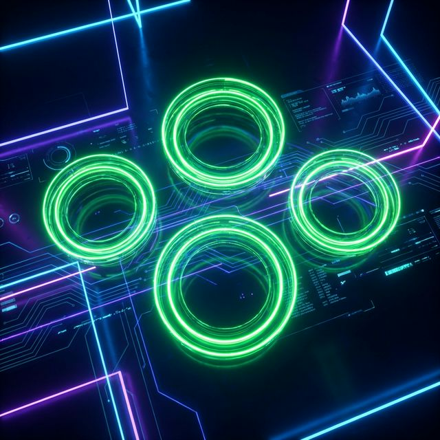
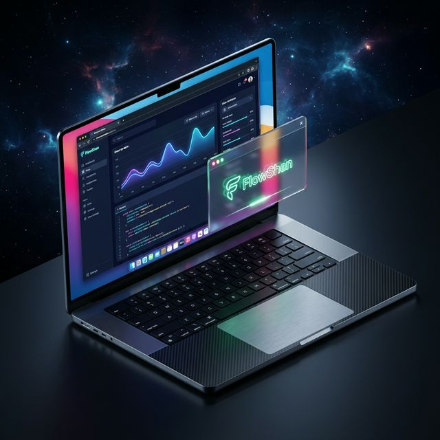

<div align="center">

<!-- Language Switcher -->
<p align="right">
  <a href="README.ar.md">العربية</a>
</p>

<!-- Title Branding -->


<br/>

> **"Productivity tools should be inspiring. Zero-latency, Glassmorphism, and Local-First sync."**

---

<!-- Live Demo Button -->
<p align="center">
  <a href="https://flowshan.vercel.app" target="_blank">
    
  </a>
  <a href="https://github.com/codeshan/FlowShan-CaseStudy" target="_blank">
    
  </a>
</p>


</div>

## 📸 Visual Gallery (The Proof)

<table align="center">
  <tr>
    <td align="center"><b>Live Dashboard (Bento Grid)</b></td>
    <td align="center"><b>Kanban Flow (Drag & Drop)</b></td>
  </tr>
  <tr>
    <td></td>
    <td></td>
  </tr>
  <tr>
    <td align="center"><b>Interactive Calendar 3.0</b></td>
    <td align="center"><b>Cinematic Notes Editor</b></td>
  </tr>
  <tr>
    <td></td>
    <td></td>
  </tr>
  <tr>
    <td align="center"><b>Full Mobile Responsiveness</b></td>
    <td align="center"><b>Telegram & Real-time Sync</b></td>
  </tr>
  <tr>
    <td></td>
    <td></td>
  </tr>
</table>

---

## 🏗️ System Architecture

The following diagram illustrates the **Hybrid Sync Engine**, managing state between LocalStorage (Guest) and PostgreSQL (Auth) with optimistic UI updates.

```mermaid
graph TD
    %% Define Styles
    classDef glass stroke:#00e5ff,stroke-width:2px,fill:#12121a,color:#ffffff
    classDef neon stroke:#9c27b0,stroke-width:2px,fill:#1b1b2f,color:#e0e0e0
    classDef action stroke:#22d3ee,stroke-width:1px,fill:#0f172a,stroke-dasharray: 5 5,color:#9ca3af

    %% Nodes
    User(("👤 User")):::glass
    
    subgraph "Frontend (Next.js)"
        UI[Glass UI Interface]:::glass
        DND[Drag & Drop Engine]:::action
        State[Zustand Store]:::action
    end
    
    subgraph "Data Layer"
        LS[LocalStorage (Guest)]:::glass
        API[Next.js API Routes]:::neon
        DB[(PostgreSQL)]:::neon
    end

    %% Flow
    User -->|Interacts| UI
    UI -->|Drag Task| DND
    DND -->|Optimistic Update| State
    State -->|Persist| LS
    
    %% Sync Flow
    User -->|Login| API
    LS -->|Sync Data| API
    API -->|Batch Insert| DB
    DB -->|New UUIDs| API
    API -->|Hydrate| State
    
    %% Real-time
    DB -.->|Cron: Deadlines| User
```

## 💾 Database Schema

A robust, relational schema designed for multi-tenancy and complex project hierarchies.



---

## ⚡ Performance Excellence

<div align="center">
  <table align="center">
    <tr>
      <td align="center"><b>Lighthouse Audit (100/100)</b></td>
      <td align="center"><b>Immediate Push Notifications</b></td>
    </tr>
    <tr>
      <td></td>
      <td></td>
    </tr>
  </table>
</div>

---

## 🛠️ Technology Galaxy

<div align="center">

| **Layer** | **Technologies** |
|:---:|:---|
| **Core** |    |
| **Styles** |   |
| **Logic** |    |
| **Infra** |   |

</div>

---

## 📂 Deep Dive: 10-Part Case Study

For in-depth architectural analysis, explore the documentation suite:

1. [**01-Overview**](docs/01-Overview.md) - Project vision and impact.
2. [**02-Problem Statement**](docs/02-Problem-Statement.md) - Friction and visual fatigue.
3. [**03-Solution Architecture**](docs/03-Solution-Architecture.md) - The 3-tier sync engine.
4. [**04-Key Features**](docs/04-Key-Features.md) - Glassmorphism & local-first.
5. [**05-Technical Decisions**](docs/05-Technical-Decisions.md) - The ADR log.
6. [**06-Challenges & Solutions**](docs/06-Challenges-Solutions.md) - Handling dependency mapping.
7. [**07-Performance Optimization**](docs/07-Performance-Optimization.md) - Bundle size & Hydration.
8. [**08-Testing & Quality**](docs/08-Testing-Quality.md) - Automated verification.
9. [**09-Deployment & DevOps**](docs/09-Deployment-DevOps.md) - Edge functions & CI/CD.
10. [**10-Results & Impact**](docs/10-Results-Impact.md) - Final outcomes.

---

<div align="center">
  
  <p>© 2026 <b>CODESHAN</b> | MIT License</p>
</div>
