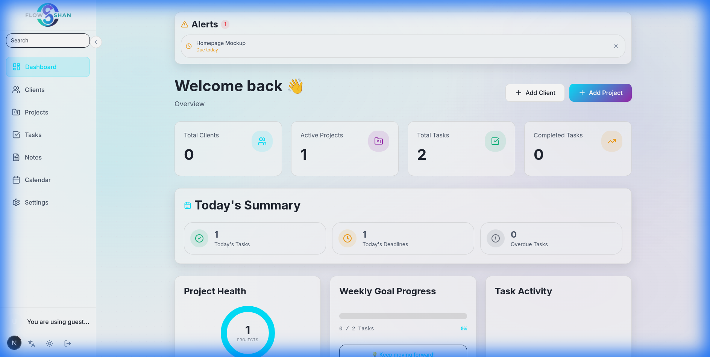
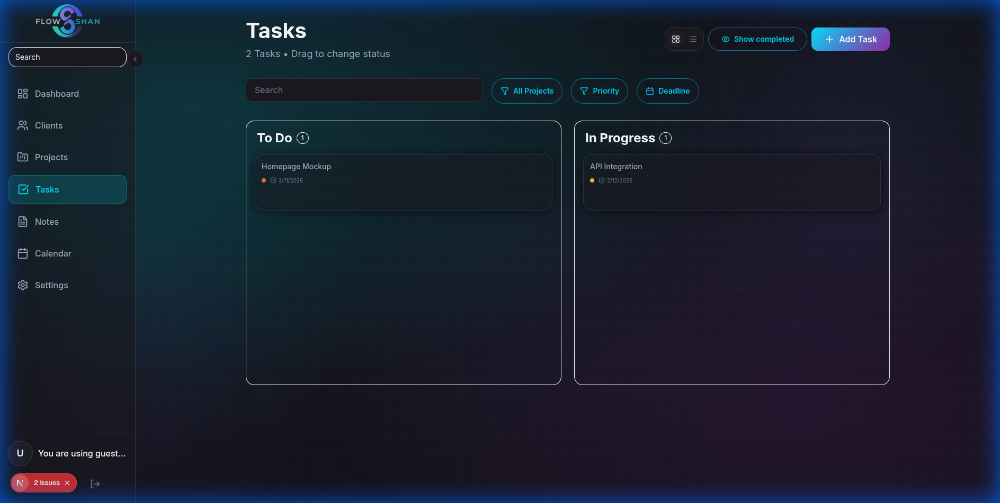
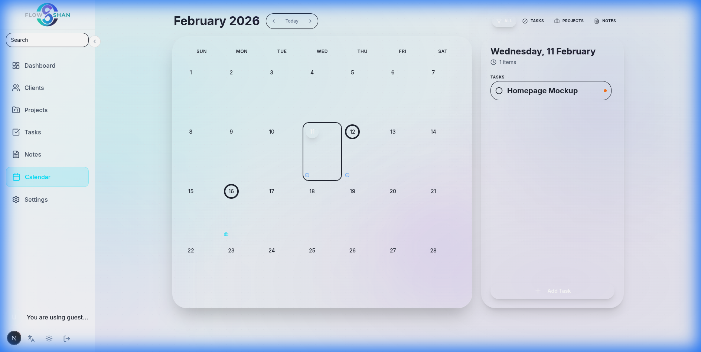
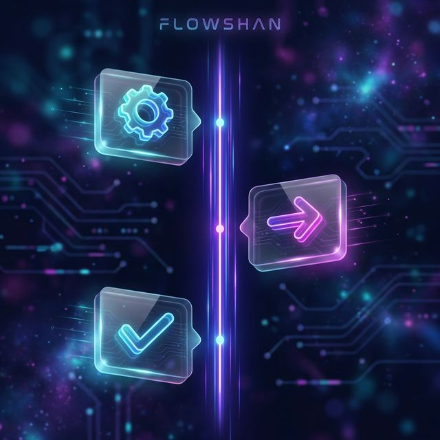

  

# FlowShan Case Study
### Local-First Productivity Platform with Cinematic UX

  
  
  

## Case Study Snapshot
| Area | Summary |
|---|---|
| Product | SaaS productivity app for projects, tasks, clients, notes, calendar |
| Core Bet | Local-first interactions, cloud sync on auth |
| UX Direction | Glassmorphism + motion + bilingual (EN/AR RTL) |
| Stack | Next.js 16, React 19, TypeScript, Tailwind 4, Zustand, Prisma, PostgreSQL |
| Outcome | Fast perceived UX, clean sync model, professional visual identity |

## Why This Project Exists
Most task tools are either visually dull or interaction-heavy with network latency.  
FlowShan was built to prove both can coexist: premium look + near-instant interaction.

## What Was Recently Improved
- Projects page empty-state UX was formalized:
  - dedicated first-project prompt when there are zero projects.
  - explicit "no results" state when filters/search return empty.
- Notes empty-state CTA alignment was fixed for consistent icon+label layout across breakpoints.

## Visual Proof

  
  
  
  

## Architecture & System View

  
  

## Reading Tracks
### Recruiter / Hiring Manager (10-15 min)
1. <a href="docs/00-Case-Study-Map.md"><b>00 - Case Study Map</b></a>
2. <a href="docs/01-Overview.md"><b>01 - Overview</b></a>
3. <a href="docs/04-Key-Features.md"><b>04 - Key Features</b></a>
4. <a href="docs/10-Results-Impact.md"><b>10 - Results & Impact</b></a>

### Tech Lead / Senior Engineer (25-40 min)
1. <a href="docs/00-Case-Study-Map.md"><b>00 - Case Study Map</b></a>
2. <a href="docs/02-Problem-Statement.md"><b>02 - Problem Statement</b></a>
3. <a href="docs/03-Solution-Architecture.md"><b>03 - Solution Architecture</b></a>
4. <a href="docs/05-Technical-Decisions.md"><b>05 - Technical Decisions</b></a>
5. <a href="docs/06-Challenges-Solutions.md"><b>06 - Challenges & Solutions</b></a>
6. <a href="docs/07-Performance-Optimization.md"><b>07 - Performance Optimization</b></a>
7. <a href="docs/08-Testing-Quality.md"><b>08 - Testing & Quality</b></a>

### Product / Stakeholder (15-20 min)
1. <a href="docs/00-Case-Study-Map.md"><b>00 - Case Study Map</b></a>
2. <a href="docs/11-Product-Scope-Requirements.md"><b>11 - Product Scope & Requirements</b></a>
3. <a href="docs/04-Key-Features.md"><b>04 - Key Features</b></a>
4. <a href="docs/10-Results-Impact.md"><b>10 - Results & Impact</b></a>
5. <a href="docs/12-Roadmap-Lessons.md"><b>12 - Roadmap & Lessons</b></a>

## Full Documentation Index
| # | Document |
|---|---|
| 00 | <a href="docs/00-Case-Study-Map.md">Case Study Map</a> |
| 01 | <a href="docs/01-Overview.md">Overview</a> |
| 02 | <a href="docs/02-Problem-Statement.md">Problem Statement</a> |
| 03 | <a href="docs/03-Solution-Architecture.md">Solution Architecture</a> |
| 04 | <a href="docs/04-Key-Features.md">Key Features</a> |
| 05 | <a href="docs/05-Technical-Decisions.md">Technical Decisions</a> |
| 06 | <a href="docs/06-Challenges-Solutions.md">Challenges & Solutions</a> |
| 07 | <a href="docs/07-Performance-Optimization.md">Performance Optimization</a> |
| 08 | <a href="docs/08-Testing-Quality.md">Testing & Quality</a> |
| 09 | <a href="docs/09-Deployment-DevOps.md">Deployment & DevOps</a> |
| 10 | <a href="docs/10-Results-Impact.md">Results & Impact</a> |
| 11 | <a href="docs/11-Product-Scope-Requirements.md">Product Scope & Requirements</a> |
| 12 | <a href="docs/12-Roadmap-Lessons.md">Roadmap & Lessons</a> |

## License
MIT License. See <a href="LICENSE">LICENSE</a>.
