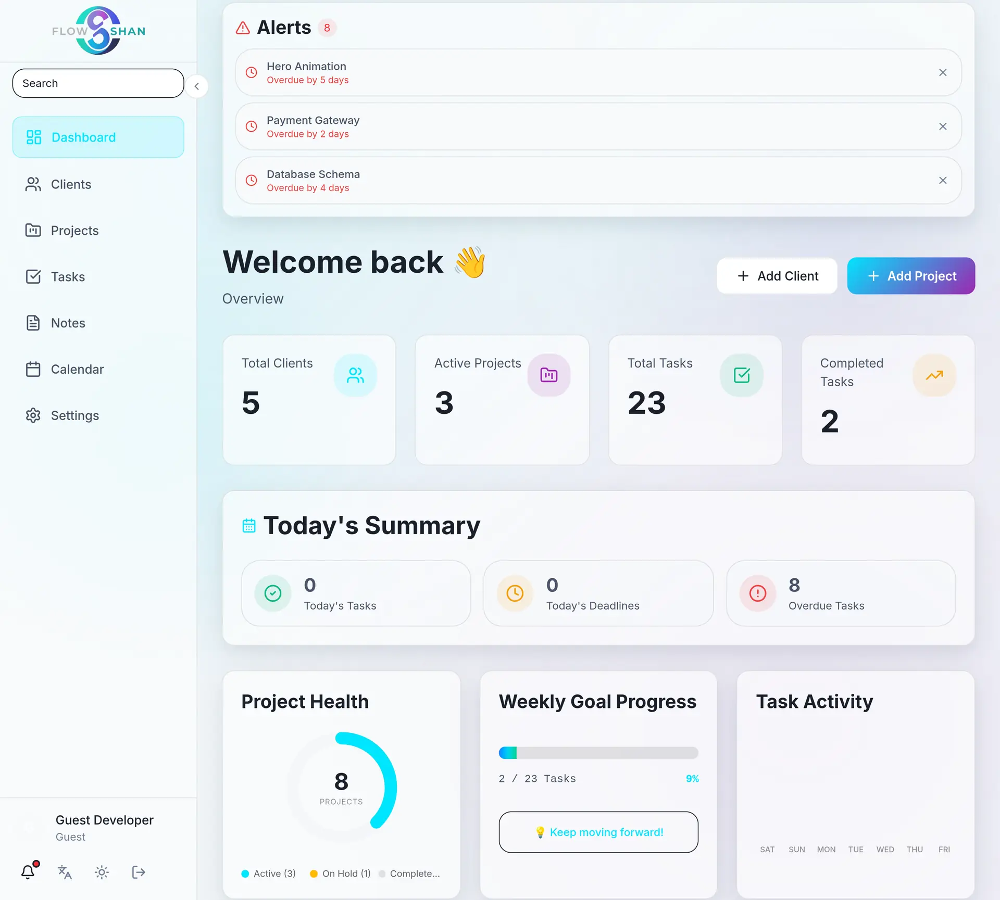

# 📋 01 - Overview & Project Vision

> **"Productivity shouldn't just be functional. It should be cinematic."**

 

 

 

## 🎯 The Vision
FlowShan reimagines the productivity dashboard not as a static table of tasks, but as a rigid, high-performance command center. 

Most productivity apps suffer from two extremes:
1.  **Ugly Utility:** Fast but looks like a spreadsheet (e.g., Trello, Jira).
2.  **Slow Beauty:** Good looking but riddled with loaders and lag (e.g., Notion, Monday).

**FlowShan aims for the sweet spot: Sub-100ms interaction speed with a Netflix-grade visual experience.**

  

 

## 💡 Core Philosophy

### 1. Local-First Architecture
We don't wait for the server. Every interaction—creating a task, moving a card, writing a note—happens **instantly** in the local state. The server syncs in the background. If the internet cuts out, you keep working.

### 2. Cinematic UX
User experience isn't just about usability; it's about *feeling*.
- **Glassmorphism:** Real-time background blurs.
- **Micro-interactions:** Smooth Framer Motion transitions.
- **Sound Design:** 900ms toast notifications that feel snappy.

  
  
   
  <em>Dual Mode: System-preference detection with zero hydration mismatch.</em>

### 3. Data Ownership
Your data lives on your device first. We use a hybrid sync engine that respects user privacy and data sovereignty.

 

 

## 🌍 Product Scope

### ✅ Core Modules

| Module | Status | Description |
|:---|:---:|:---|
| **📊 Dashboard** | ✅ | Real-time analytics, greeting system, and activity heatmap. |
| **📋 Kanban Board** | ✅ | Drag-and-drop task management with optimistic updates. |
| **📅 Calendar** | ✅ | Interactive monthly/weekly views with task integration. |
| **📝 Notes** | ✅ | Rich-text editor with auto-save and local persistence. |
| **👥 Clients** | ✅ | CRM-lite features for managing client relationships. |

### 🏗️ Technical Scope

| Aspect | Details |
|:---|:---|
| **Lines of Code** | ~12,500+ (TypeScript) |
| **Components** | 61+ React Server/Client Components |
| **State Management** | 7 Zustand Stores (Tasks, Projects, UI, Settings...) |
| **Database** | PostgreSQL + Prisma ORM (Schema-driven) |
| **API** | 33 Serverless Endpoints (Next.js API Routes) |

 

 

## 🚀 Development Timeline

| Phase | Duration | Focus |
|:---|:---|:---|
| **Phase 1: Foundation** | Weeks 1-2 | Next.js 16 Setup, Prisma Schema, Auth (Clerk/NextAuth). |
| **Phase 2: Core UX** | Weeks 3-4 | Kanban Board (Dnd-Kit), Framer Motion implementation. |
| **Phase 3: Local-First** | Weeks 5-6 | Optimistic UI patterns, Guest Mode (localStorage). |
| **Phase 4: Sync Engine** | Weeks 7-8 | Background sync, conflict resolution, offline support. |
| **Phase 5: Polish** | Weeks 9-10 | Glassmorphism, Sound Design, Performance Tuning. |

 

 

## 🔗 Navigation

