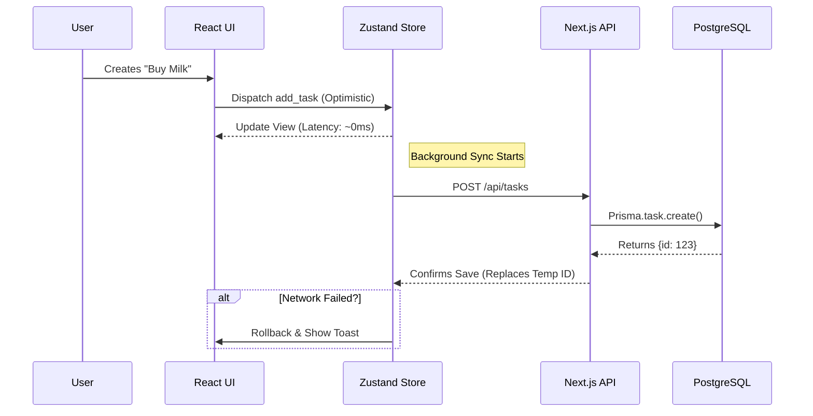

# 🏗️ 03 - Solution Architecture

> **"A bridge between the speed of local memory and the reliability of cloud storage."**

 

 

 

## 🏛️ The 4-Layer Architecture

FlowShan isn't just a Next.js app; it's a **distributed state system**. We architected it in four distinct layers:

### 1. Presentation Layer (The "Skin")
*   **Tech:** React 19, Framer Motion, Tailwind CSS v4.
*   **Role:** Renders the UI and handles micro-interactions.
*   **Constraint:** Must never block the main thread for >16ms (60fps).

### 2. State Layer (The "Brain")
*   **Tech:** Zustand (7 specific stores).
*   **Role:** Acts as the Single Source of Truth for the UI.
*   **Logic:** Optimistically applies changes before network requests.

### 3. Sync Layer (The "Bridge")
*   **Tech:** Custom `SyncService`, `use-tasks.ts`.
*   **Role:** Debounces user input and orchestrates API calls.
*   **Mechanism:** Handles the critical transition from `guest_id` to `user_id`.

### 4. Persistence Layer (The "Vault")
*   **Tech:** PostgreSQL, Prisma ORM.
*   **Role:** Permanent storage and relational integrity.

 

 

## 🔄 Data Sync Lifecycle

How a single "Task Creation" flows through the system:

 

 

## 🛠️ Verified Code Evidence

### The State Stores
We split state to prevent unneccesary re-renders:
*   `src/store/ui-store.ts`: Modal states, sidebar toggle.
*   `src/store/project-store.ts`: Lists, cards, and board logic.
*   `src/store/task-store.ts`: Task details and subtasks.

### The API Surface
*   `src/app/api/projects/route.ts`: CRUD for projects.
*   `src/app/api/tasks/route.ts`: Task management.
*   `src/app/api/notes/route.ts`: Rich text notes.

 

 

## 🔗 Navigation

