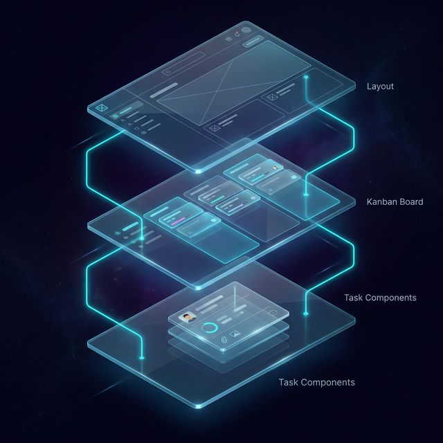

<!-- Language Switcher -->

  <a href="04-Key-Features.ar.md">العربية</a>

<!-- Typing SVG Header -->

 

> **"Features are only as good as the experiences they create."**

---

## 💎 Signature Features

### 1. Glassmorphism Design System
- **Frost & Blur**: High-end visual language using `backdrop-filter: blur()`.
- **Dynamic Theming**: Seamless switching between Dark Space and Light Glass modes.
- **Micro-Animations**: Framer Motion powered transitions for every interaction.

### 2. The Local-First Kanban Board
- **Fluid Drag & Drop**: Interaction speed decoupled from the network.
- **Infinite Subtasks**: Deep task nesting with real-time percentage tracking.
- **Relational Integrity**: Projects, Tasks, and Clients are linked locally and synced as a unit.

### 3. Bilingualism by Design
- **RTL Support**: Native Arabic support with professional typography.
- **Contextual Translation**: Smart language switching that maintains user state.

### 4. Interactive Calendar 3.0
- **Unified Scheduling**: Drag & Drop tasks between days seamlessly.
- **Heatmap Visualization**: Day cells glow based on task density.
- **Note Integration**: View and manage daily notes alongside tasks.

### 5. Cinematic Notes
- **Transition Architecture**: Expanding cards into full editors using Framer Motion LayoutGroup.
- **Contextual Linking**: Notes linked to Projects/Clients for easier retrieval.
- **Pinning System**: Priority notes stay at the top.

### 6. Client Sharing Portal
- **Secure Access**: Generate unique, token-based links for clients.
- **Read-Only View**: Allow stakeholders to track progress without altering data.
- **Expiration Controls**: Set time limits on shared access links.

### 7. Advanced Data Management
- **Intelligent Filtering**: Multi-condition filtering (Project, Priority, Date).
- **Soft Delete System**: Protective data handling for critical workflows.

---

  
   
  <b>High-End Visual Breakdown of UI Components</b>
   
  

  <a href="../README.md">🏠 Back to Home</a>

