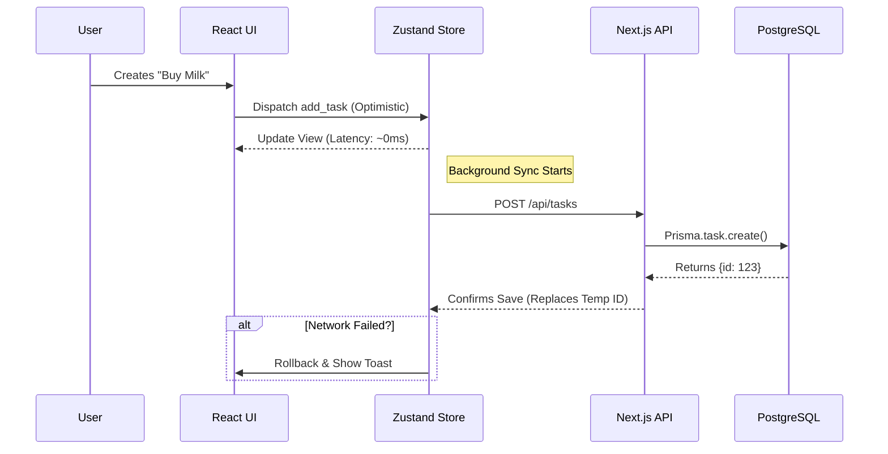

# 🏗️ 03 - هندسة الحل والمعمارية

> **"جسر بين سرعة الذاكرة المحلية وموثوقية التخزين السحابي."**

 

 

 

## 🏛️ العمارة رباعية الطبقات (The 4-Layer Architecture)

FlowShan ليس مجرد تطبيق Next.js؛ إنه **نظام حالة موزع**. قمنا بتصميمه في أربع طبقات متميزة:

### 1. طبقة العرض (The "Skin")
*   **التقنية:** React 19, Framer Motion, Tailwind CSS v4.
*   **الدور:** عرض واجهة المستخدم ومعالجة التفاعلات الدقيقة.
*   **القيد:** يجب ألا يتم حظر الخيط الرئيسي (Main Thread) لأكثر من 16ms (للحفاظ على 60fps).

### 2. طبقة الحالة (The "Brain")
*   **التقنية:** Zustand (7 مخازن محددة).
*   **الدور:** تعمل كمصدر وحيد للحقيقة (Single Source of Truth) لواجهة المستخدم.
*   **المنطق:** تطبيق التغييرات بشكل متفائل (Optimistically) قبل طلبات الشبكة.

### 3. طبقة المزامنة (The "Bridge")
*   **التقنية:** خدمة `SyncService` مخصصة، `use-tasks.ts`.
*   **الدور:** تخفيف واستقبال مدخلات المستخدم وتنظيم اتصالات API.
*   **الآلية:** تعالج الانتقال الحرج من `guest_id` إلى `user_id` عند التسجيل.

### 4. طبقة الثبات (The "Vault")
*   **التقنية:** PostgreSQL, Prisma ORM.
*   **الدور:** التخزين الدائم والتكامل العلائقي للبيانات.

 

 

## 🔄 دورة حياة مزامنة البيانات (Data Sync Lifecycle)

كيف تتدفق عملية "إنشاء مهمة" واحدة عبر النظام:

 

 

## 🛠️ أدلة موثقة من الكود (Verified Code Evidence)

### مخازن الحالة (State Stores)
قمنا بفصل الحالة لمنع إعادة التصيير غير الضرورية:
*   `src/store/ui-store.ts`: حالات النوافذ المنبثقة، تبديل الشريط الجانبي.
*   `src/store/project-store.ts`: القوائم، البطاقات، ومنطق اللوحة.
*   `src/store/task-store.ts`: تفاصيل المهام والمهام الفرعية.

### سطح واجهة البرمجة (The API Surface)
*   `src/app/api/projects/route.ts`: عمليات CRUD للمشاريع.
*   `src/app/api/tasks/route.ts`: إدارة المهام.
*   `src/app/api/notes/route.ts`: ملاحظات النصوص الغنية.

 

 

## 🔗 التنقل

