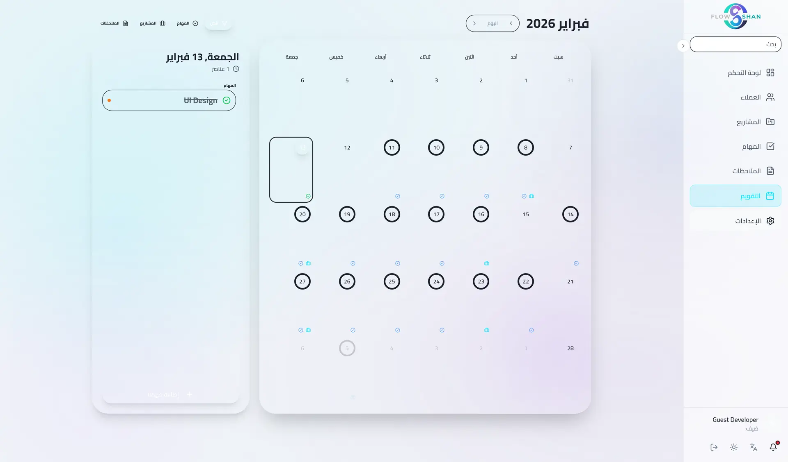
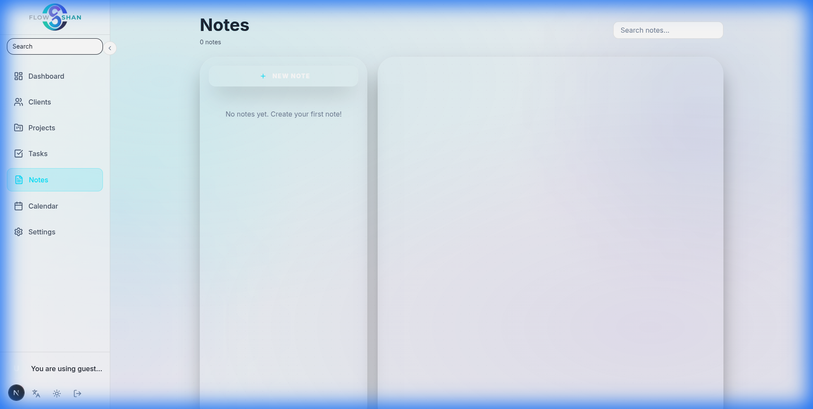

# ✨ 04 - الميزات الجوهرية والتجربة السينمائية

> **"مبني على فلسفة أن كل نقرة يجب أن تكون ممتعة."**

 

 

 

## 1. 📋 لوحة كانبان السينمائية (Cinematic Kanban)
لم نكن نريد مجرد لوحة؛ كنا نريد **مساحة عمل انسيابية**.
- **الميزات:**
  - سحب وإفلات المهام بين الحالات (Statuses) بنعومة.
  - تحديثات واجهة متفائلة (بدون دوائر تحميل).
  - أشرطة تقدم فورية لاكتمال المشروع.
- **الكود:** `src/components/kanban/kanban-board.tsx`
- **التقنية:** `@dnd-kit/core` + كشف تصادم مخصص (custom collision).

  

 

## 2. 📅 التقويم التفاعلي (Interactive Calendar)
تقويم يعمل كمركز للقيادة، ليس للعرض فقط.
- **الميزات:**
  - تصور المواعيد النهائية وتوزيع المهام.
  - سحب المهام لإعادة جدولتها (Drag to Reschedule).
  - اضغط للتعديل مباشرة من خلية اليوم.
- **الكود:** `src/components/calendar/interactive-calendar.tsx`

  

 

## 3. 📝 ملاحظات "محلية أولاً" (Local-First Notes)
بيئة كتابة خالية من التشتت.
- **الميزات:**
  - محرر نصوص غني (Rich Text) مبني على ProseMirror.
  - عرض شبكي (Grid View) بتخطيط Masonry للبطاقات.
  - حفظ تلقائي فوري في التخزين المحلي.
- **الكود:** `src/components/notes/editor.tsx`

  

 

## 4. 📊 لوحة المعلومات (The Dashboard)
النافذة الواحدة لإنتاجيتك.
- **الميزات:**
  - **نظام الترحيب:** "صباح الخير/مساء الخير" ذكي حسب السياق.
  - **خريطة الحرارة (Activity Heatmap):** تصور لنشاطك على غرار Github.
  - **تنبيهات عاجلة:** ظهور تلقائي للعناصر المتأخرة.
- **الكود:** `src/app/[locale]/(platform)/dashboard/page.tsx`

  

 

## 5. 🛡️ شبكة الأمان: الحذف المرن والتراجع (Undo)
أخطاء المستخدم واردة، لذا قمنا ببناء تدفق حذف **غير مدمر**.
- **الميزات:**
  - **الحذف المرن (Soft Delete):** لا تُحذف المهام نهائياً فوراً؛ بل يتم ترقيمها في قاعدة البيانات.
  - **نافذة الـ 5 ثواني:** يظهر إشعار (Toast) تفاعلي فور الحذف للتراجع.
  - **استعادة بنقرة واحدة:** الضغط على "تراجع" يفعل منطق `restoreTask` لتعود المهمة فوراً دون تحديث الصفحة.
- **التقنية:** مكتبة `sonner` للإشعارات + `restoreTask` في مخزن الحالة (Store).

 
 

## 8. 🚀 معالج التهيئة الذكي (Smart Onboarding)
لتقليل الاحتكاك وتوجيه المستخدم الجديد، قمنا ببناء معالج تهيئة متكامل.
- **الميزات:**
  - **محدد الدور (Persona Selector):** الاختيار بين مستقل، طالب، مدير، أو مخصص.
  - **الافتراضيات الديناميكية:** تحديد الأقسام والوحدات المفعلة تلقائياً بناءً على الدور المختار.
  - **واجهة زجاجية تفاعلية:** انتقالات انزلاقية ناعمة تعتمد على `framer-motion` لتوفير تجربة ترحيبية بريميوم.
- **الكود:** `src/components/onboarding/onboarding-wizard.tsx`

 

## 9. ⚙️ لوحة معلومات متكيفة ومساحة عمل مخصصة
بدلاً من عرض واجهات فارغة أو جداول ثابتة، أصبحت مساحة العمل قابلة للتخصيص بالكامل.
- **الميزات:**
  - **تبديل الوحدات:** إمكانية تشغيل أو إيقاف الأقسام المختلفة (العملاء، المشاريع، المهام، الملاحظات، التقويم) أثناء وقت التشغيل.
  - **تكييف الواجهة:** يتغير تخطيط الأعمدة والشبكات تلقائياً لتوسيع المكونات المفعلة وإخفاء المعطلة بشكل كامل لتجنب الفراغات.
  - **إعدادات مساحة العمل:** قسم مخصص داخل الإعدادات لتعديل الدور والتحكم في الوحدات المفعلة.
- **الكود:** `src/app/[locale]/(platform)/settings/page.tsx` + `src/app/[locale]/(platform)/dashboard/page.tsx`

 

 

## 🔗 التنقل

