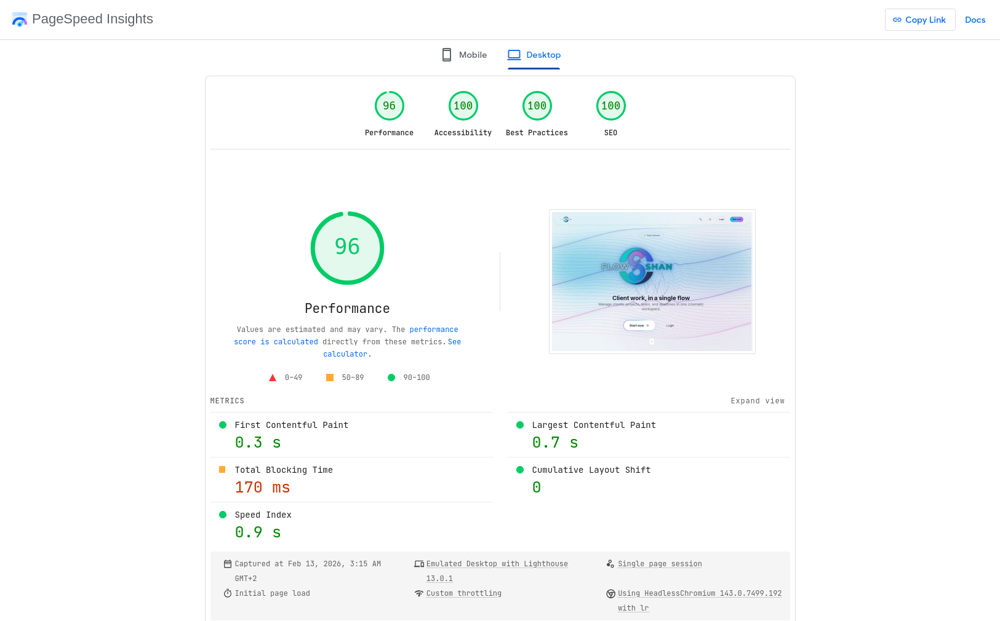
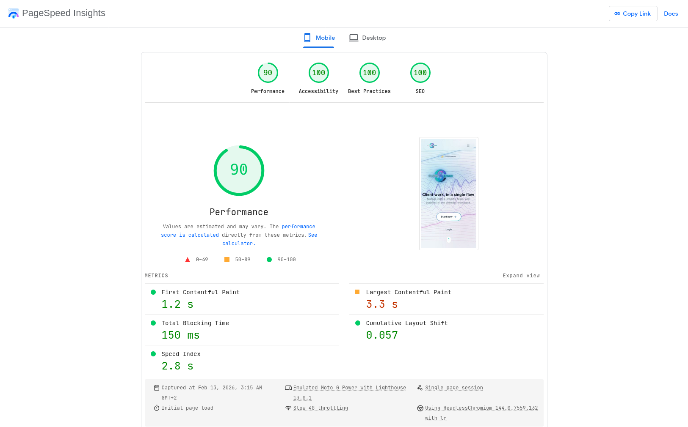

<div align="center" dir="rtl">

# ⚡ 07 - هندسة الأداء العالي


> **"السرعة ليست ميزة إضافية. إنها الأساس."**

<br/>

[](06-challenges-solutions.md)
[](08-testing-quality.md)

</div>

<br/>
<div align="center">

</div>
<br/>

<div dir="rtl">

## 1. استراتيجية "صفر تحميل" (The "Zero-Loading" Strategy)

في تطبيقات الصفحة الواحدة (SPA) التقليدية، كل إجراء يشغل دائرة تحميل (Spinner). في FlowShan، نستخدم **التحديثات المتفائلة (Optimistic Updates)**.

**السيناريو:** المستخدم يرشف مهمة.
*   **الطريقة القديمة:** أظهر تحميل داخل الزر -> انتظر الرد -> احذف المهمة.
*   **طريقة FlowShan:** احذف المهمة فوراً من مخزن الواجهة (Store). أرسل طلب API. أظهر خطأ فقط في حالة الفشل النادرة.

<br/>

## 2. العمليات الحسابية ومذكرة التخزين (Memoization)

تحتاج لوحة كانبان إلى تصفية 500+ مهمة وتوزيعها على 3 أعمدة (Todo, In Progress, Done) في كل مرة يتم فيها التصيير.
لمنع هبوط الإطارات (FPS Drop) أثناء السحب، نستخدم `useMemo`:

```typescript
// src/app/[locale]/(platform)/tasks/page.tsx
const groupedTasks = useMemo(() => {
  return query.result.reduce((acc, task) => {
    // منطق تجميع ثقيل
  }, {});
}, [query.result]); // إعادة التشغيل فقط إذا تغيرت البيانات، ليس عند التحويم
```

<br/>

## 3. انضباط حجم الحزمة (Bundle Size Discipline)

نحن نراقب تكلفة الاستيراد (Import Cost) بصرامة.
*   بدلاً من `moment.js` (ضخمة)، نستخدم `date-fns` (قابلة للإزالة الجزئية Tree-shakeable).
*   بدلاً من `lodash` (كبيرة)، كتبنا دوال مساعدة مخصصة للعمليات البسيطة.

<br/>
<div align="center">

</div>
<br/>

## 🏆 دليل النقاط في Lighthouse

حققنا درجات مثالية من خلال تحسين LCP (عرض العناصر) و CLS (تغيرات التخطيط).

<div align="center">
  
  
</div>

<br/>
<div align="center">

</div>
<br/>

## 🔗 التنقل

<div align="center">

[](06-challenges-solutions.md)
[](08-testing-quality.md)

</div>

</div>